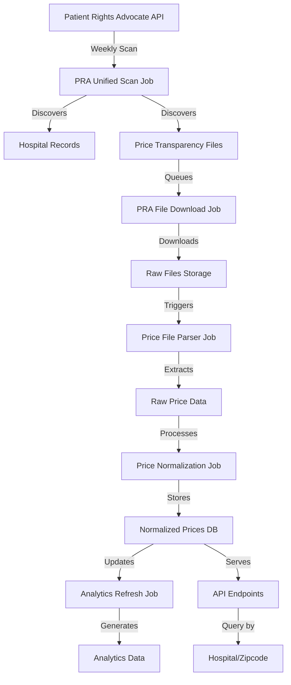

# Glimmr Job Processing Architecture

## Overview

The Glimmr job processing system is designed to automatically discover, download, parse, and normalize hospital price transparency data from across the United States. This document outlines the complete data pipeline from discovery to API consumption.

## Data Pipeline Flow



## Important Updates (July 2025)

### Removed Queues
The following queues were removed as they were redundant:
- **HOSPITAL_IMPORT**: Removed because PRA Unified Scan already handles all hospital imports directly from the Patient Rights Advocate API
- **DATA_VALIDATION**: Removed as it was never implemented or used

All scheduled hospital refreshes now use the PRA Unified Scan queue directly.

## Job Types and Responsibilities

### 1. PRA Unified Scan (`pra-unified-scan`)
**Schedule**: Twice daily (6 AM, 6 PM)
**Purpose**: Discover hospitals and their price transparency files
**Process**:
- Fetches data from Patient Rights Advocate API for all 51 states
- Creates/updates hospital records in database
- Identifies new or changed price transparency files
- Queues download jobs for changed files

**Key Features**:
- Smart change detection (file size, last retrieved timestamp)
- Progress tracking
- State-by-state processing
- Test mode for development (CA, FL, TX only)

### 2. PRA File Download (`pra-file-download`) ✅ IMPLEMENTED
**Trigger**: Queued by PRA Unified Scan
**Purpose**: Download price transparency files from hospitals
**Process**:
- Download file from hospital URL
- Store in object storage (MinIO/S3)
- Update file metadata in database
- Queue parsing job

**Requirements**:
- Retry logic for failed downloads
- Handle various file formats (CSV, JSON, Excel, ZIP)
- Stream large files to storage
- Update download status and metrics

### 3. Price File Parser (`price-file-parser`) ✅ IMPLEMENTED
**Trigger**: Queued by file download jobs
**Purpose**: Extract price data from transparency files
**Process**:
- Detect file format
- Parse CSV/JSON/Excel files
- Extract price records
- Store raw price data with file reference

**Challenges**:
- Various CSV formats and encodings
- Nested JSON structures
- Excel files with multiple sheets
- Large file handling (streaming)
- Malformed data handling

### 4. Price Normalization (`price-update`) ✅ IMPLEMENTED
**Trigger**: Queued by parser jobs
**Purpose**: Normalize and standardize price data
**Process**:
- Map various code types (CPT, DRG, HCPCS, ICD-10)
- Standardize price categories
- Calculate min/max negotiated rates
- Validate data quality
- Store normalized prices

**Key Tasks**:
- Code standardization
- Price validation
- Duplicate detection
- Quality scoring

### 5. Analytics Refresh (`analytics-refresh`) ✅ IMPLEMENTED
**Schedule**: Daily or on-demand
**Purpose**: Generate analytics and aggregations
**Process**:
- Calculate price statistics by hospital
- Generate regional averages
- Update trending data
- Build search indices

### 6. Data Export (`export-data`) ✅ IMPLEMENTED
**Trigger**: On-demand via API
**Purpose**: Export data in various formats
**Formats**: JSON, CSV, Excel

## Database Schema

### Core Tables

#### `hospitals`
- Stores hospital information
- Tracks price transparency file metadata
- Links to external identifiers (NPI, CMS, CCN)

#### `price_transparency_files`
- Tracks individual transparency files
- Processing status and metrics
- Links to hospital records

#### `prices`
- Normalized price records
- Service codes and descriptions
- Negotiated rates by payer
- Quality metrics

#### `jobs`
- Generic job tracking
- Status, progress, duration
- Error tracking
- Resource metrics

#### `job_logs`
- Detailed job execution logs
- Error messages and stack traces
- Debug information

## File Processing Strategy

### Supported Formats
1. **CSV Files**
   - Use `papaparse` for robust parsing
   - Handle various encodings (UTF-8, ISO-8859-1)
   - Stream processing for large files

2. **JSON Files**
   - Standard hospital price transparency schema
   - Handle nested structures
   - Stream parsing with `JSONStream`

3. **Excel Files**
   - Use `xlsx` library
   - Process multiple sheets
   - Handle various Excel formats

4. **ZIP Files**
   - Extract and process contained files
   - Handle nested archives

### Data Extraction Patterns

```typescript
interface PriceRecord {
  code: string;
  codeType: 'CPT' | 'DRG' | 'HCPCS' | 'ICD-10';
  description: string;
  grossCharge: number;
  discountedCashPrice?: number;
  payerRates: {
    [payerName: string]: {
      negotiatedRate: number;
      billingClass?: string;
    };
  };
}
```

### Error Handling Strategy

1. **File Download Errors**
   - Retry with exponential backoff
   - Store error details for debugging
   - Alert on repeated failures

2. **Parsing Errors**
   - Log problematic rows/records
   - Continue processing valid data
   - Track data quality metrics

3. **Normalization Errors**
   - Flag records for manual review
   - Store original data for reference
   - Generate quality reports

## API Endpoints

### Hospital Price Lookup
```
GET /api/v1/hospitals/:hospitalId/prices
GET /api/v1/hospitals/:hospitalId/prices/:serviceCode
```

### Zipcode Price Search
```
GET /api/v1/prices/search
  ?zipcode=90210
  &radius=10
  &serviceCode=CPT:99213
  &includeNegotiatedRates=true
```

### Price Comparison
```
GET /api/v1/prices/compare
  ?hospitalIds=uuid1,uuid2,uuid3
  &serviceCodes=CPT:99213,DRG:470
```

## Monitoring and Observability

### Key Metrics
- Jobs processed per queue
- Success/failure rates
- Processing duration
- File download sizes
- Price records extracted
- Data quality scores

### Alerts
- Job failures exceeding threshold
- Queue backlog growing
- Processing time degradation
- Storage capacity warnings

### Admin Dashboard
- Real-time job status
- Queue health monitoring
- Error log aggregation
- Performance metrics
- Manual job triggers

## Security Considerations

1. **File Validation**
   - Virus scanning on upload
   - File type verification
   - Size limits enforcement

2. **Data Privacy**
   - No PHI/PII in price data
   - Audit logging for access
   - Role-based permissions

3. **Rate Limiting**
   - Respect hospital server limits
   - Implement request throttling
   - Use polite crawling practices

## Future Enhancements

1. **Machine Learning**
   - Automatic format detection
   - Price anomaly detection
   - Quality prediction

2. **Real-time Updates**
   - WebSocket notifications
   - Change detection alerts
   - Live price updates

3. **Advanced Analytics**
   - Price trending
   - Regional comparisons
   - Procedure cost predictions

## Implementation Priority

1. **Phase 1**: Core Pipeline
   - Implement PRA File Download processor
   - Implement basic CSV parser
   - Implement price normalization
   - Basic API endpoints

2. **Phase 2**: Enhanced Processing
   - Add JSON/Excel support
   - Improve error handling
   - Add job monitoring UI
   - Implement analytics

3. **Phase 3**: Advanced Features
   - ZIP file handling
   - Advanced search APIs
   - Performance optimization
   - ML integration